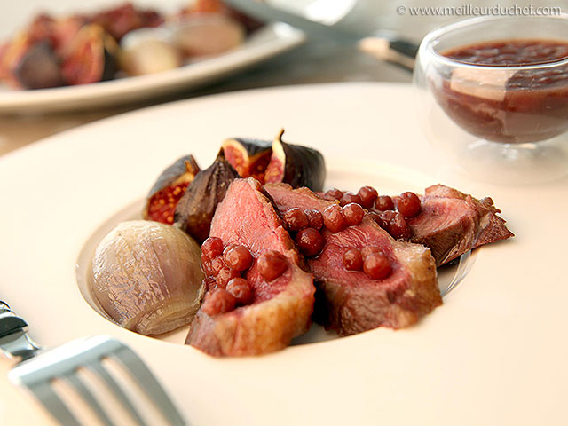
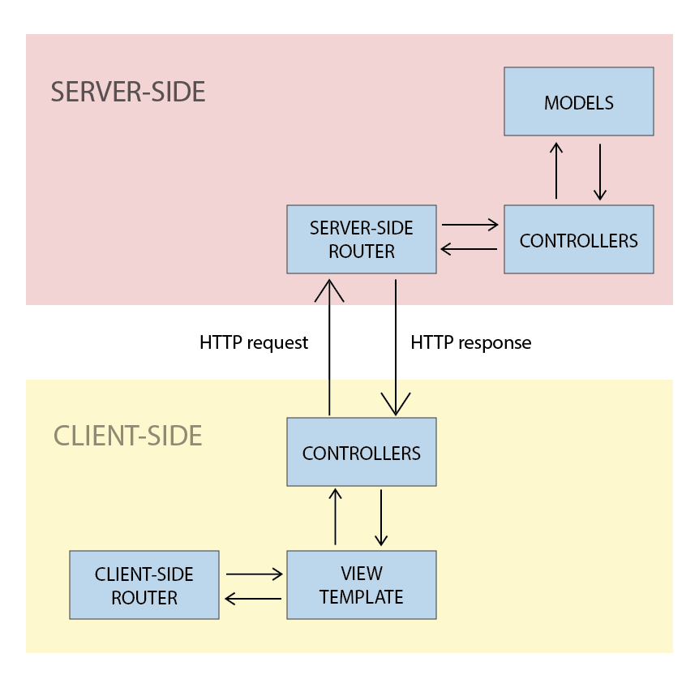

----------------------

# ARCHITECTURE MVC
Découper les différentes étapes d'une architecture MVC avec node et mongo

Ce chapitre s'inscrit dans le module **Node MVC et SQLite3**

1. [ ] [Node MVC SQLite3 étape 1](https://github.com/simplonco/node-mvc-sqlite-step1)
    
2. [ ] [Node MVC SQLite3 étape 2](https://github.com/simplonco/node-mvc-sqlite-step2)
    
3. [x] [Node MVC SQLite3 étape 3](https://github.com/simplonco/node-mvc-sqlite-step3)

Il existe un [module identique avec MongoDB](https://github.com/simplonco/node-mvc-mongodb-step1).

Vous pouvez trouver ce module dans les parcours suivants :

+ Développeur Web Fullstack

------------

### VIEWS

Du coup le plat est prêt mais on a besoin d’un conteneur pour toute cette data.
On va pas la servir juste comme ça à l’arrache à même la poêle en mode JSON.
C’est là qu’entre les _views_.

A la base le MVC ça a été pensé au moment où on ne faisait que du **server side rendering**.

C’est pour ça que quand on fait des **single page app** avec react ou angular et qu’on se renseigne sur le model MVC on trouve des schémas comme ça et on comprend pas trop.

Le server-side rendering c’est un peu le resto à l’ancienne qui te dresse ton assiette comme des pros en cuisine.
Les single page app c’est un peu la cantine bonne franquette du hipster où le serveur te sert dans l’assiette direct à table.
_(Attention cependant : avec l’arrivée d’http 2, le server-side rendering revient à la mode et React est déjà sur le coup.)_

Donc avec une single page app, globalement ton controller **server-side** il va gérer seulement la base de données, et ton controller **client-side** il va faire interface avec ton api.

Avec un framework MVC comme Angular :
+ Tu défini tes routes public avec _ng-router_.
+ Tu vas définir dans des _services_ les appels aux différentes _routes_ de l’api et _server-side controllers_ (en utilisant _restangular_ par exemple)
+ Tes _client-side controllers_ vont faire appel à ces _services_ et traiter la data pour feed la _view_ (mettre au format tes timestamps, faire des .toUpperCase etc...)
+ Tes directives vont gérer les évènements

Avec React :
+ Tu défini tes routes avec react-router
+ Tu peux faire tes appels en utilisant restful, axios, ou isomorphic fetch.
 React ne propose pas de compartimenter selon un model MVC, donc c’est à chacun de faire les bons choix et de gérer le _data-flow_ intelligement selon le _lifecycle_ des components.
L’équipe de facebook propose d’utiliser un design pattern un peu différent pour le front qu’on appelle _flux_.
